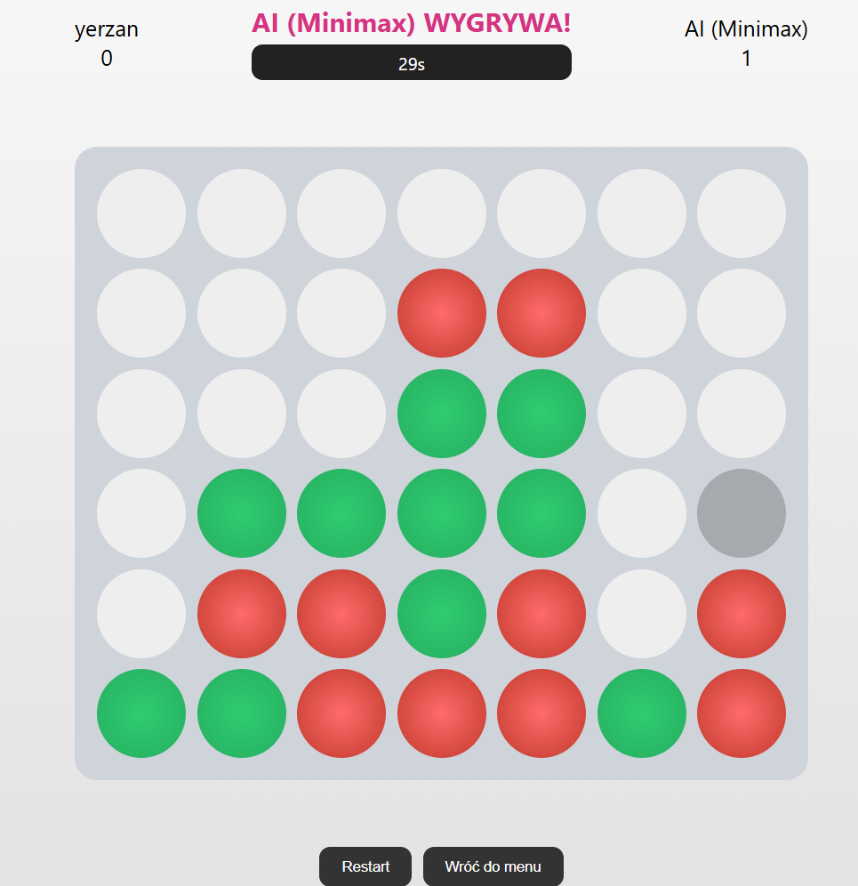
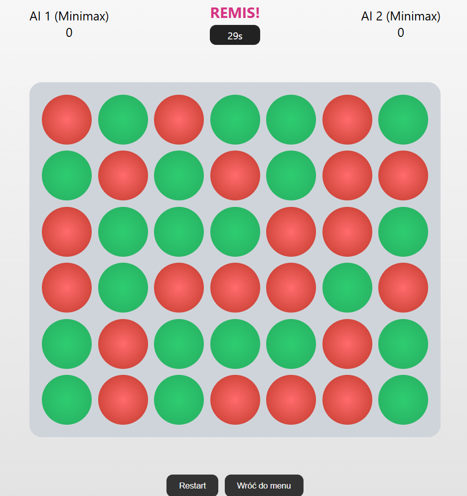
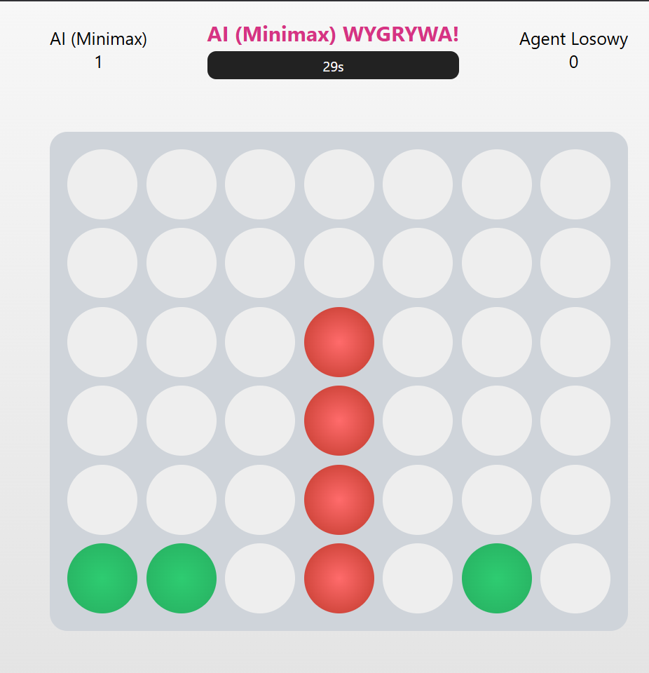

# Projekt Zaliczeniowy: Sztuczna Inteligencja - Connect 4 (Minimax)
**Autorzy:** Mykhailo Kleban, Yevhen Marchak

## 1. Opis teoretyczny wykorzystanych algorytmów

Tematem projektu jest rozwiązanie praktycznego problemu polegającego na stworzeniu agenta sztucznej inteligencji zdolnego do gry w Connect 4 (Czwórki) na planszy 7x6. Problem ten zalicza się do sekwencyjnych gier dwuosobowych o sumie zero. Do jego rozwiązania wykorzystano następujące algorytmy i mechanizmy:

* **Algorytm Minimax:** Jest to algorytm rekurencyjny wykorzystywany w teorii gier. Analizuje on drzewo możliwych stanów gry na zadaną liczbę ruchów do przodu (tzw. głębokość). Jeden gracz (AI) dąży do maksymalizacji wyniku (MAX), a drugi do jego minimalizacji (MIN). Algorytm zakłada, że przeciwnik gra optymalnie.
* **Odcięcie Alfa-Beta (Alpha-Beta Pruning):** Zoptymalizowana wersja algorytmu Minimax. Znacząco zmniejsza liczbę węzłów ocenianych w drzewie gry poprzez odcinanie gałęzi, o których wiadomo, że nie przyniosą lepszego rezultatu niż opcje zbadane wcześniej. Pozwala to na analizę głębszych poziomów drzewa w tym samym czasie, co znacząco zwiększa siłę gry bota.
* **Funkcja heurystyczna (Evaluation Function):** Ponieważ przeszukanie całego drzewa gry aż do stanów końcowych przy pustej planszy jest niemożliwe obliczeniowo, zastosowano autorską funkcję oceniającą bieżący stan planszy. Program analizuje tzw. "okna" (4 połączone pola w poziomie, pionie lub po skosie). Przydziela dodatnie punkty za ułożenie własnych 2, 3 lub 4 klocków, oraz bardzo wysokie kary ujemne, jeśli przeciwnik ułoży 3 klocki z miejscem na czwarty. Wymusza to na AI agresywne blokowanie gracza.

## 2. Omówienie implementacji w kodzie

Projekt podzielono na moduły dla zachowania czystości architektury. Logika backendowa została napisana w języku Python z użyciem bibliotek Flask i NumPy, natomiast interfejs w HTML/CSS/JS.

* **Implementacja Minimaxa (`ai.py`):** Główna funkcja `minimax(board, depth, alpha, beta, maximizing)` rekurencyjnie ocenia stany. Warunkiem stopu jest osiągnięcie zadanej głębokości (`depth == 0`) lub napotkanie węzła końcowego (wygrana, przegrana, remis), co sprawdzane jest za pomocą funkcji pomocniczej `is_terminal_node`.
* **Implementacja Heurystyki (`ai.py`):** Funkcja `score_position` ocenia całą planszę, priorytetyzując środkową kolumnę (wyższa waga punktowa). Plansza jest dzielona na mniejsze segmenty 4-elementowe i ewaluowana przez `evaluate_window`, która nadaje ostateczne wartości punktowe sterujące decyzjami Minimaxa.
* **Aplikacja / GUI (`app.py`, `script.js`):** Rozgrywka została zaimplementowana w interfejsie graficznym w przeglądarce. Interfejs wysyła stan planszy oraz wybraną trudność (głębokość drzewa) do serwera po API (endpoint `/move`), a backend oblicza ruch algorytmem AI i zwraca zaktualizowany stan do frontendu.

## 3. Napotkane problemy i sposoby ich rozwiązania

Podczas tworzenia projektu natrafiliśmy na wyzwania logiczne i architektoniczne, które wymagały optymalizacji:

1.  **Luka w początkowej funkcji heurystycznej (AI pozwalało wygrać):**
    * *Problem:* Wstępna wersja funkcji oceniającej posiadała warunek karzący AI (ujemne punkty) za sytuację, gdy przeciwnik ułoży 3 klocki. Gdy gracz dokładał czwarty klocek (wygrywając), warunek dla "3 klocków" przestawał być spełniony, co skutkowało brakiem ujemnej punktacji. Minimax uznawał, że pozwolenie przeciwnikowi na ułożenie 4 klocków jest "tańsze" punktowo niż blokowanie 3 klocków.
    * *Rozwiązanie:* Przebudowano heurystykę w `evaluate_window` dodając potężną karę za 4 klocki przeciwnika. Wdrożono też funkcję `is_terminal_node`, która natychmiast kończy poszukiwania w drzewie po znalezieniu wygranej, zwracając wartości krańcowe (np. 10000000 dla wygranej AI).
2.  **Desynchronizacja planszy i komunikacji z serwerem:**
    * *Problem:* Odświeżenie strony w przeglądarce czyściło planszę w JavaScript, ale serwer w Pythonie zapamiętywał stary układ. Powodowało to błędy, w których nowe klocki opadały w połowie pustej planszy, zatrzymując się na niewidzialnych elementach z poprzedniej gry.
    * *Rozwiązanie:* Zaimplementowano asynchroniczne żądania API `fetch("/reset")`, które bezwarunkowo czyszczą obiekt planszy na serwerze każdorazowo przy wyborze trybu gry w GUI.

## 4. Przebieg rozgrywki

Program w pełni obsługuje trzy warianty rozgrywki do testowania zachowania sztucznej inteligencji.

### A. Rozgrywka: Człowiek vs AI (Minimax)
AI bardzo precyzyjnie wykorzystuje błędy gracza. W poniższej sytuacji gracz próbował budować poziomą/ukośną strukturę, jednak Minimax znalazł optymalną ścieżkę do zwycięstwa i błyskawicznie ułożył cztery pionowe klocki, ignorując zmyłki przeciwnika.



### B. Rozgrywka: AI (Minimax) vs AI (Minimax)
Sytuacja, w której zmierzyły się dwa algorytmy Minimax na tym samym poziomie głębokości poszukiwań. Z powodu optymalnego działania mechanizmów blokowania z obu stron oraz braku błędów typowych dla człowieka, rozgrywka doprowadziła do całkowitego zapełnienia planszy i zakończyła się remisem.



### C. Rozgrywka: AI (Minimax) vs Agent losowy (Random)
Starcie zaawansowanego algorytmu z agentem wykonującym losowe posunięcia. Minimax bez najmniejszego problemu ignorował chaotyczne układy budowane przez agenta losowego i celowo dążył do ułożenia własnej pionowej linii, wygrywając grę w bardzo krótkim czasie.



## 5. Wykorzystanie Generatywnej Sztucznej Inteligencji

Zgodnie z wymogami projektowymi informujemy, że w procesie deweloperskim korzystano ze wsparcia narzędzia **Gemini 3.1 Pro**.

* **Analiza i debugowanie logiki AI:** Modelu użyto do diagnozy opisanego wyżej problemu z funkcją heurystyczną (brak reagowania bota na wygrywający ruch przeciwnika). Wygenerowany kod naprawczy (implementacja natychmiastowego sprawdzania stanów terminalnych) został w pełni poddany manualnej weryfikacji. Poprawność dowiedziono testami rozgrywki, po których bot zaczął agresywnie blokować gracza.
* **Rozwiązywanie problemów architektonicznych:** AI pomogło wskazać błąd komunikacji (desynchronizację) pomiędzy stanem globalnym obiektu w Flask a żądaniami asynchronicznymi w JavaScript, co pozwoliło poprawnie zaimplementować przycisk restartu i resetowania stanów serwera.

## 6. Uruchomienie projektu

Wymagania: Python 3.x

```bash
# 1. Utworzenie i aktywacja środowiska wirtualnego
python -m venv venv
venv\Scripts\activate

# 2. Instalacja wymaganych pakietów
pip install Flask numpy

# 3. Uruchomienie serwera (z folderu głównego lub backend)
python backend/app.py
